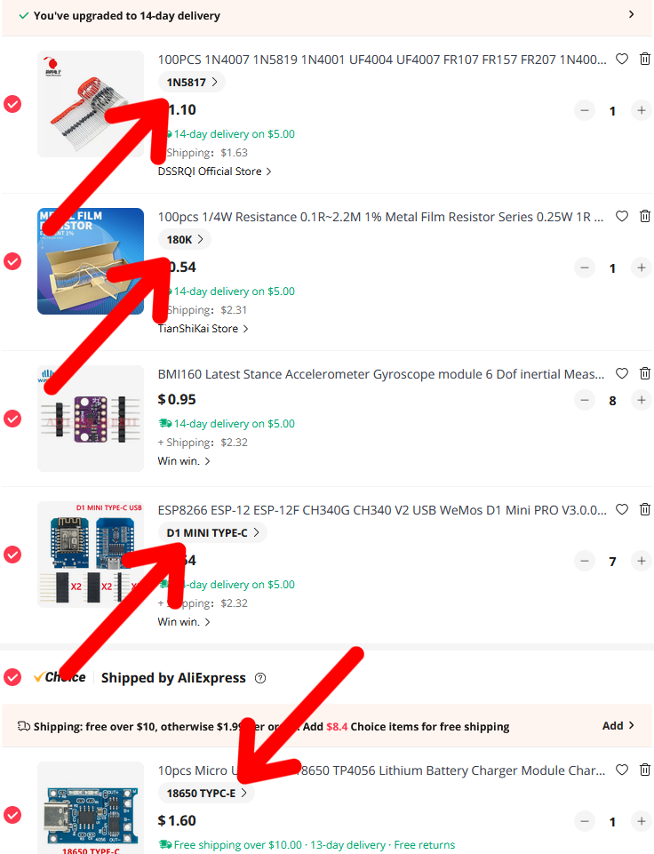
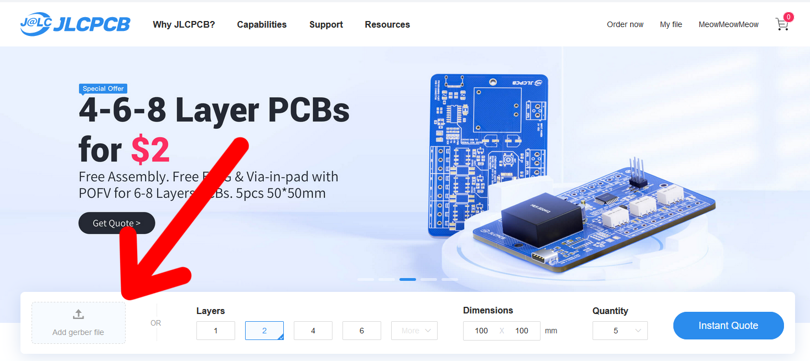
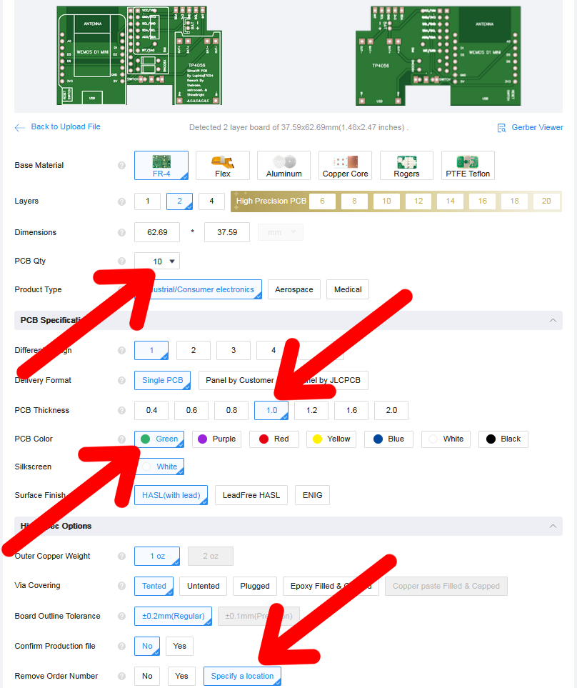
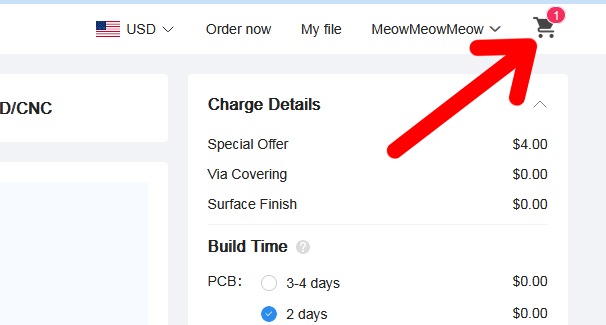
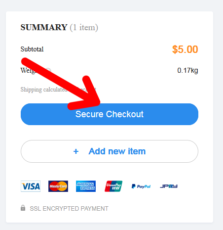

# SlimeVR Hyperion Multi-IMU BMI BNO Case and PCB

## Purchasing Guide
### Recommended Components (PCB)
| Component | Variant | Link |
| -------------------- | --------------- | -------------------------------------------------------------------------------- |
| WeMos D1 Mini | Micro or Type-C | <https://www.aliexpress.us/item/2251832465432818.html> |
| TP4056 | 18650 Micro or Type-C | <https://www.aliexpress.us/item/2251832290307200.html> |
| BMI160 | N/A | <https://www.aliexpress.us/item/2255799866368692.html> |
| BNO085 | N/A | <https://shop.slimevr.dev/products/slimevr-imu-module-bno085> |
| SS22F32/DPDT 2P2T Switches | N/A | <https://www.aliexpress.us/item/2251832789220847.html> |
| 1/4W Metal Film Resistor | 180**K** | <https://www.aliexpress.us/item/3256803737288214.html> |
| Schottky Rectifier Diode | 1N5817 | <https://www.aliexpress.us/item/2255800018624086.html> |
| Header Pins | 2.54mm | <https://www.aliexpress.us/item/3256805804439042.html> |
| JST PH 2.0mm Connector | Right Angle/Side Entry & 2P | <https://www.aliexpress.us/item/3256804769340392.html> |
| Lithium Polymer Ion Battery | 503759 with Connector (PH) | <https://www.aliexpress.us/item/3256805125875396.html> |

> [!IMPORTANT]
> Purchase 30% more boards (WeMos D1 Mini, TP4056, and BMI160/BNO085 than what is needed. There is the possibility that components are dead on arrival or get damaged during assembly/soldering.

> [!NOTE]
> One order of Resistors, Diodes, Header Pins, Switches, and PH 2.0mm Connectors is enough for the entire project.

> [!NOTE]
> These are my recommended sellers/stores and recommended components just for the main tracker unit. You can always purchase components from elsewhere and that you may need Additional components are needed for extensions. Other stores/sellers may have a higher rate of dead on arrival. The linked stores for WeMos D1 Mini, TP4056, and BMI160/BNO085 are recommended by the SlimeVR DIY Community.

> [!NOTE]
> Type-C Ports are more durable. As for charging, USB-C to USB-C Power Delivery doesn't work. Use USB-A to USB-C cables to charge trackers.

> [!TIP]
> In your AliExpress Cart, you can verify that you selected the correct variant of the component here.

### Optional Components (PCB)
| Component | Variant | Link |
| -------------------- | --------------- | -------------------------------------------------------------------------------- |
| JST XH 2.54mm Connector | Right Angle/Side Entry & 4P(BMI160)/5P(BNO085) | <https://www.aliexpress.us/item/2251832822174658.html> |
| JST XH 2.54mm Connector with Female Cable | Right Angle/Side Entry & 4P(BMI160)/5P(BNO085)| <https://www.aliexpress.us/item/2255799934230488.html> |
| Sheathed Wire Cable | 28AWG & 4Cores(BMI160)/5Cores(BNO085) | <https://www.aliexpress.us/item/2255800384086289.html> |

> [!NOTE]
> I recommend using Sheathed Wire Cable and soldering it directly onto the PCB for extensions. (JST XH Connector is not needed for this method) Usually, less connection issues than using connectors.

### Recommended Consumables/Tools
| Component | Variant | Link |
| -------------------- | --------------- | -------------------------------------------------------------------------------- |
| Desoldewring Iron| Choose your electrical outlet | <https://www.aliexpress.us/item/3256804929123151.html> |
| Rosin Flux | Liquid or Gel Type | N/A |

### Recommended Components (Case)
| Component | Variant | Link |
| -------------------- | --------------- | -------------------------------------------------------------------------------- |
| Trilancer Elastic Cinch Straps | See note below | <https://www.amazon.com/dp/B099RNRT7Z> |
| GoPro Chest Mount Harness | See note below | <https://www.aliexpress.us/item/3256805774922789.html> |

> [!NOTE]
> 12in works for ankles. 18in for thinner thighs and 24in for thicker thighs. Chest (if not using GoPro Chest Harness) and Hips can be done by doubling up on 18in/24in straps. Choose what you need for your body and how many trackers you are planning to make. 3 Size Combo and either 18in/24in package would be a start.

> [!NOTE]
> There are 2 types of GoPro Chest Mount Harness. One that clips in and the other one fasten by a bolt. Be sure to purchase one one for the case you are 3D Printing.

### Ordering PCBs from JLCPCB
1. Download the Gerber file from [here](raw/main/PCB/Gerber_PCB_Hyperion%20SlimeVR%20Multi-IMU%20BMI%20BNO.zip).
2. Go to [JLCPCB](https://jlcpcb.com)
3. Click on "Add Gerber File" and upload the zip Gerber file.

4. Select the PCB Qty and PCB Color of your Choice. Select 1.0 for PCB Thickness and select "Specify a location" for Remove Order Number.

> [!IMPORTANT]
> Set PCB Thickness to 1.0

> [!NOTE]
> When ordering PCBs, please check if the case recommends a certain thickness it is designed for. For example, the case in this repository and Cheesecake recommend 1.0mm Thickness. If unspecified, the default 1.6mm will do. The case in this repository has loose tolerances incase you ordered the default 1.6mm thickness, it will work okay.

> [!NOTE]
> JLCPCB usually produces Green colored PCB the quickness. Other colors have additional days added.

> [!NOTE]
> For Remove Order Number, when "Specify a location" is selected, it will the order number will be printed at where the text **JLCJLCJLCJLC** is located. In this case, at the bottom of the TP4056 module footprint.
5. Click to View Cart.

6. Click Secure Checkout.

## Soldering/Assembly Guide

### Written Guide

> [!WARNING]
> Please work at a well ventilated area. It is recommended to use a fume extractor if working indoors. If you do not have one, use a fan to blow fumes/smoke away from your face.

> [!WARNING]
> It is recommended to use eye production. Especially when splitting header pins apart with a cutter and when trimming down header pins and ends of resistors/diodes.

> [!WARNING]
> If working with leaded solder, be sure to wash your hands when you are done including under your fingernails. Wipe down and vacuum the floors and surfaces of your workspace and anything you may have cross-contaminated.

> [!TIP]
> Using external flux (preferably Rosin) will allow solder to flow to automatically flow into the correct area

> [!TIP]
> A wooden clothespin can be used to hold the boards together while soldering

> [!NOTE]
> Resistor and Diodes

### Video Guide (No Audio)

## Case Guide

## Troubleshooting

Join [SlimeVR Discord](https://discord.gg/SlimeVR) and ask in either the #technical-support or #DIY channels. It would be helpful for you to provide a description of your issue, photos of your soldering (front & back), and a log output from Settings > Serial Console with your tracker plugged into your computer via data USB cable into your WeMos D1 Port (non-charging). You will need to press the **Reboot** button to get the complete log.

### Using a Multimeter

## Contribute
Feel free to create a pull request to this repository or mention me in SlimeVR's Discord #DIY channel (Do not DM me, it will go to my Message Request and I will not reply to you there)  for improvement ideas or your modifications of the source files below.

### Source Files
| Component | Link |
| -------------------- | -------------------------------------------------------------------------------- |
| PCB | <https://oshwlab.com/Newbie2620/slimevr-multi-imu-bmi-bno> |
| Case | [Fusion 360 Files](../blob/master/LICENCE) |

## Credit
| Contributor | Description | Link |
| -------------------- | ---------------------------------------- | -------------------------------------------------------------------------------- |
| Smeltie | Original Concept of the Hyperion Case | <https://github.com/Smeltie/Hyperion> |
| Lupinixx | Original BMI160 PCB Design and SS12D00G3 Tray used in this repository | <https://github.com/Lupinixx/SlimeVR-Hyperion-BMI160-PCB> |
| Tmandel | BNO085 modifications to the original PCB | <https://oshwlab.com/tmandel/slimevr-hyperion-503759-bno085> |
| Astrocast123 | Improvement on Tmandel's BNO08X PCB revision | <https://oshwlab.com/astrocast123/SlimeVR-Hyperion-BNO08X> |
| Shine Bright | Improvements to PCB, new case design, and this guide write-up in this repository | <https://oshwlab.com/astrocast123/SlimeVR-Hyperion-BNO08X> |

## Licence
This project is licensed under the MIT licence.
